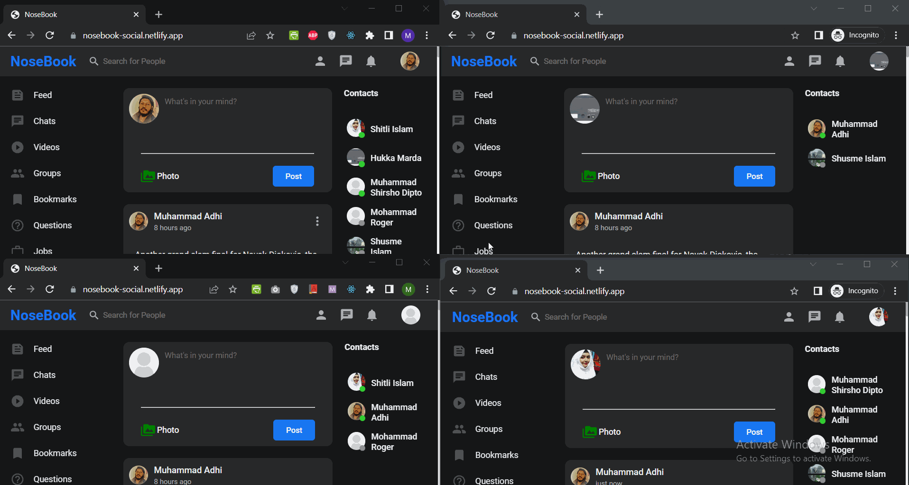
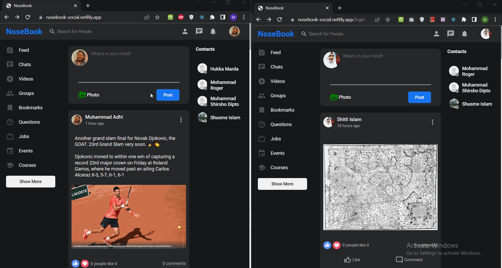
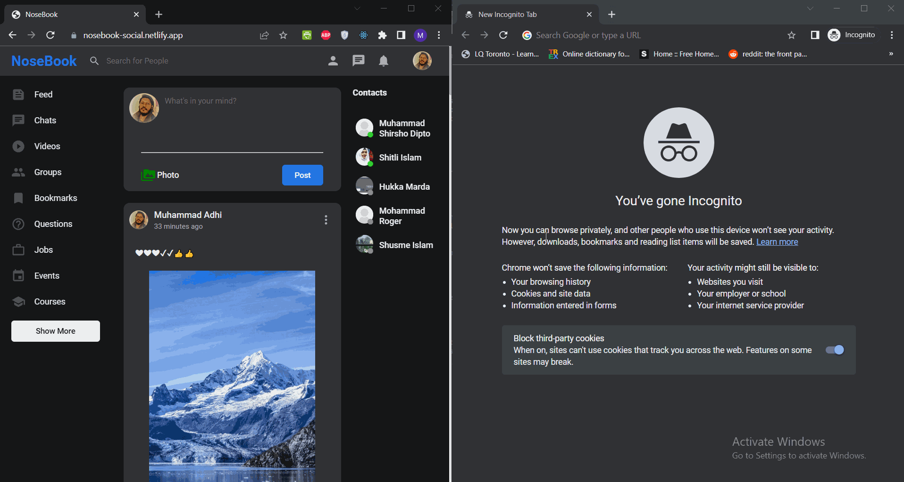
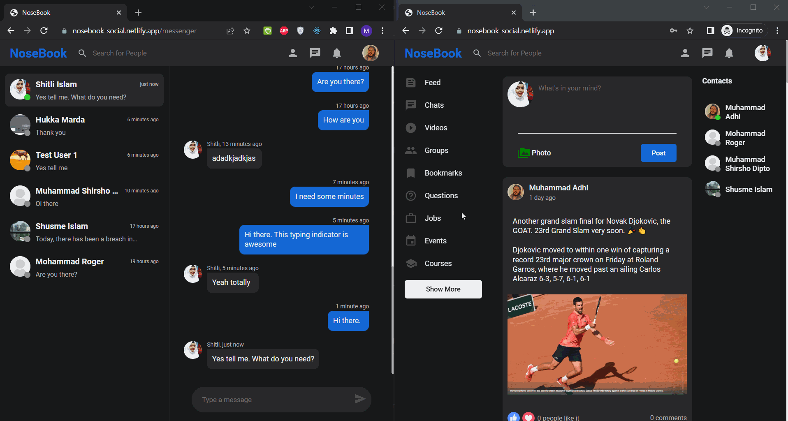

# NoseBook

NoseBook is a Facebook clone that I have made as a final project for my full stack web development course. It has the core functionalities that Facebook has, which includes uploading posts, commenting on posts, liking a post/comment, sending/accepting friend requests, real time messaging, and real time notification system for posts, messages, friend requests, and a wide range of other features.

[View Live](https://nosebook-social.netlify.app/login)

[API repository](https://github.com/ShirshoDipto/social-media-api)

[Socket repository](https://github.com/ShirshoDipto/nosebook-socket)


## Technologies used

1. MongoDB (with Mongoose)
2. ExpressJS
3. React
4. NodeJS
5. Passport.js
6. JWT
7. Socket.io
8. Cloudinary
9. Multer
10. Bcrypt.js
11. Express Validator
12. HTML React Parser
13. Material UI

and more

## Running Locally

To run the api and socket server locally, follow the instructions on the [API Repository](https://github.com/ShirshoDipto/social-media-api) and [Socket repository](https://github.com/ShirshoDipto/nosebook-socket) respectively.

### Clone Repository

```
git clone git@github.com:ShirshoDipto/social-media-client.git
```

```
cd social-media-client
```

### Set up environment variables

```
REACT_APP_SERVERROOT = <Address of the api server. https://nosebook-api.fly.dev or local address, e.g http://localhost:5000>

REACT_APP_SOCKETROOT = <Address of the socket server. https://nosebook-socket.onrender.com or local address, e.g http://localhost:4000>

REACT_APP_CLIENTROOT = <Address of the client. http://localhost:3000 by default>
```

### Install packages and start

```
npm install
```

```
npm run build
```

```
npm install -g serve
```

```
serve -s build
```

## Features & Highlights

### 1. Authentication

- Basic Login and Signup with username and password.
- Login/Signup with a google account.
- Login and Signup form validation from the backend.
- Logout.

### 2. Users

- Update/remove profile picture.
- Update/remove cover picture.
- Update profile biodata.
- Error handling in profile update.
- Search users by first name, last name, and email address.

### 3. Friendships

- Send, accept, and reject friend requests from other users.
- Remove users from the friend list.
- Show friendship status upon entering a user’s profile.

### 4. Posts

- Timeline posts on homepage.
- Users posts on specific profile page.
- Infinite scrolling using Intersection Observer.
- Error handling in uploading new post.
- Create posts.
- Update own posts.
- Delete own posts.
- Include images with posts.
- Include emojis with posts.
- Include line breaks in posts.

### 5. Comments

- Comment on posts.
- Update own comments.
- Delete own comments.
- Infinite scrolling using Intersection Oberver.
- Include emojis with comments.
- Include line breaks in comments.

### 6. Likes

- Like/unlike posts.
- Like/unlike comments.

### 7. Notifications

- Notifications for new posts.
- Notifications for new messages.
- Notifications for new friend requests.
- Notification when a friend request is accepted.
- Pagination for notifications.

### 8. Messenger

- Create a chat conversation with a user. _Similar to opening a new chat conversation with another user on Skype_.
- Sorting of chat conversations based on the date of the most recent message. **The algorithm used here employes the fundamantal component of mergesort algorithm.**
- Unseen messages indicator on chat conversations.
- Send and receive messages real time.

### 9. Socket

- Integration of messenger notification system to the main notification system.
- Real time messaging.
- Continuous typing indicator. **It is better than that of Skype and Telegram.**
- Real time notification for new post.
- Real time notification for new friend request.
- Real time notification when a friend request is accepted.
- Real time notification for new unseen messages.
- Online and offline friends on homepage. Sorted based on a friend's activity status. Active friends appear first.
- Online and offline users on messenger page.

## Additional Gifs

### 1. Search for users:


### 2. Update Profile Information:


### 3. Create post and real time notification for new posts:



### 4. Send and accept friend requests:



### 5. Online/offline friends:



### 6. Real time messaging:


